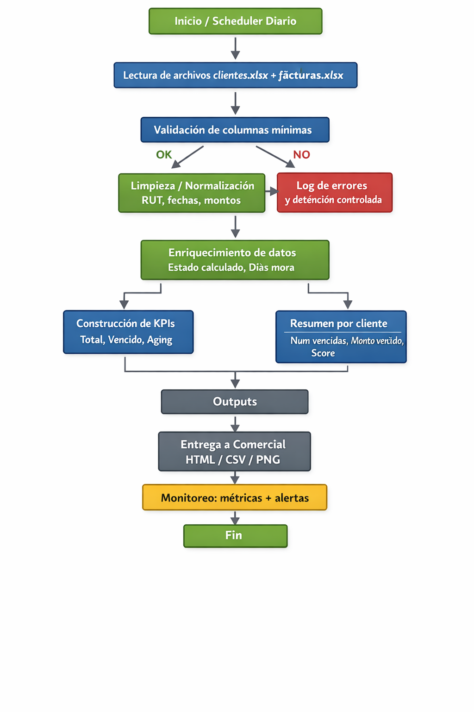

```{r setup, include=FALSE}
knitr::opts_chunk$set(echo = TRUE, message = FALSE, warning = FALSE)
```
---

## 1) Configuración

```{r config}
# === Rutas ===
BASE_DIR   <- getwd()
DATA_DIR   <- file.path(BASE_DIR, "data")
OUTPUT_DIR <- file.path(BASE_DIR, "output")

# Archivos esperados (MVP)
ARCH_CLIENTES <- file.path(DATA_DIR, "clientes.xlsx")
ARCH_FACTURAS <- file.path(DATA_DIR, "facturas.xlsx")

# Script del MVP (Entrega 2)

SCRIPT_MVP <- file.path(BASE_DIR, "Entregable2.1.R")

# Control: ejecutar o solo documentar
EJECUTAR_MVP <- FALSE

dir.create(OUTPUT_DIR, showWarnings = FALSE, recursive = TRUE)

suppressPackageStartupMessages({
  library(readxl)
  library(dplyr)
  library(stringr)
  library(lubridate)
  library(ggplot2)
  library(knitr)
  library(kableExtra)
  library(DiagrammeR)
})
```

---

## 2) Resumen ejecutivo (para evaluación)

**Qué se entrega en la Entrega 3 (esta entrega):**

- **(4) Documentación**: diagrama del proceso + “model card” (adaptada al scoring) + detalle de limpieza/transformación de datos.
- **(5) Despliegue**: cómo llevarlo a producción (opciones realistas para Sheriff).
- **(6) Monitoreo**: qué indicadores vigilar, alertas y rutina de revisión.

**Qué NO se implementa aún (alcance MVP actual):**
- Envío automático de correos desde R.
- Modelo predictivo avanzado (ML). El “modelo” actual es un **scoring heurístico** (reglas).

---

## 3) Evidencia rápida del MVP (referencia Entrega 2)

### 3.1 Ejecutar el script del MVP (opcional)

```{r ejecutar-mvp, eval=EJECUTAR_MVP}
source(Entregable2.1)
```

### 3.2 Archivos de salida esperados

- `output/base_cobranza.csv`: facturas + estado calculado + días de mora.
- `output/resumen_cobranza.csv`: resumen por cliente (vencidas, monto, score, nivel).
- `output/top10_monto_vencido.png`: gráfico Top 10 clientes por deuda.

---

# 4) Documentación del proyecto

## 4.1 Diagrama del proceso (para Bizagi/Visio)

El siguiente diagrama representa el flujo operativo del sistema: 

```{r, echo=FALSE, out.width="100%"}

```

Este diagrama permite visualizar de forma sencilla los pasos internos que se siguen para
la obtencion de los output necesarios para la toma de decisiones. Destaca la necesidad 
de tener "columnas minimas" como por ejemplo las que identifican a los clientes y las fechas de emision
de las facturas.
---

## 4.2 Limpieza y transformación de datos

### 4.2.1 Inputs y columnas mínimas

**clientes.xlsx** (mínimo):
- `RUT Plataforma Sheriff` (o equivalente).
- `RazonSocial` (si no existe, se puede operar solo con RUT).
- `Mail` (opcional).

**facturas.xlsx** (mínimo):
- `RUT` (o equivalente).
- `Folio`
- `Emision` (dd/mm/yyyy)
- `Vencimiento` (dd/mm/yyyy)
- `FechaPago` (vacío/NA si no pagada)
- `TotalFacturado` (CLP)

### 4.2.2 Transformaciones clave

- **Normalización de RUT**: quitar puntos/espacios, estandarizar guion y K (may/min).
- **Fechas**: lectura con formato chileno (día/mes/año) usando `dmy()` o `as.Date(..., '%d/%m/%Y')`.
- **Montos**: asegurar numéricos (sin separadores).
- **Estandarización de nombres**: `rename()` para que ambos archivos compartan `RUT`.
- **Cálculo**:
  - `Estado_Calculado` (Pagado / Vencido / Por vencer)
  - `Dias_Mora` para vencidas
  - KPIs y resumen por cliente

---

## 4.3 “Model card” adaptada (Vetiver como referencia)

### 4.3.1 Modelo / lógica

- **Tipo**: scoring heurístico.
- **Objetivo**: priorizar gestión de cobranza (riesgo y monto).
- **Variables**:
  - `NumVencidas`
  - `MontoVencido`
  - `DiasMoraProm`

**Score (referencia)**:  
`Score = 2*NumVencidas + (MontoVencido/1.000.000) + 0.02*DiasMoraProm`

**Clasificación**:
- Bajo / Medio / Alto (por umbrales definidos en el MVP).

### 4.3.2 Uso esperado en negocio

- Comercial ve **Top 10 por monto vencido** (decisión rápida).
- Cobranzas usa tabla priorizada por **Score / Nivel**.

### 4.3.3 Limitaciones

- No predice probabilidad real de pago, solo prioriza con reglas.
- Depende de calidad de datos (fechas y pagos correctos).

### 4.3.4 Próximos pasos

- Agregar histórico (DSO, % pago a tiempo).
- Entrenar un modelo predictivo y versionar con Vetiver.

---

# 5) Despliegue (cómo llevarlo a producción)

## 5.1 Despliegue recomendado

1. Carpeta compartida con `data/` (clientes y facturas actualizados).
2. Scheduler (Windows Task Scheduler / cron) ejecuta diario:
   - `Rscript Entregable2.1.R`
3. Se generan outputs en `output/` (CSV + PNG + reporte).
4. Comercial consume el HTML/PNG/CSV.

**Ventajas**: rápido y fácil.  
**Riesgos**: rutas/permisos; se mitiga con logs y estándares de carpeta.

## 5.2 Alternativa mejorada 

Requiere mayor destresa en el uso de Rstudio.

- Docker + CI (GitHub Actions).
- Dashboard (Shiny/Quarto/Power BI).

---

# 6) Monitoreo (cómo controlar la solución)

## 6.1 Salud del proceso

- ¿Corrió sin errores?
- Tiempo de ejecución.
- % fechas inválidas.
- % RUT faltante/no normalizable.
- Variación brusca del número de facturas procesadas vs día anterior.

## 6.2 Métricas de negocio

- Monto vencido total (tendencia).
- Aging 0–30 / 31–60 / 61–90 / 90+.
- Top 10 clientes por deuda (y cambios).
- Tasa de recuperación (si se integra pago posterior).

## 6.3 Alertas (posible futura implementacion)

- Si `MontoVencido` sube > X% semanal → alerta a Finanzas y Comercial.
- Si `Aging_90+` supera umbral → escalamiento.
- Si faltan columnas críticas → detener y avisar (evita reportes erróneos).


## 6.4 Rutina de revisión

- Diario: Top 10 + Aging.
- Semanal: tendencia + efectividad (pagos recuperados).
- Mensual: recalibrar score/umbrales y revisar datos maestros.

## 6.5 Registro Histórico (posible futura implementacion)

Los resultados de cada ejecución pueden almacenarse para:
- Auditoría
- Análisis histórico
- Mejora continua del modelo

---